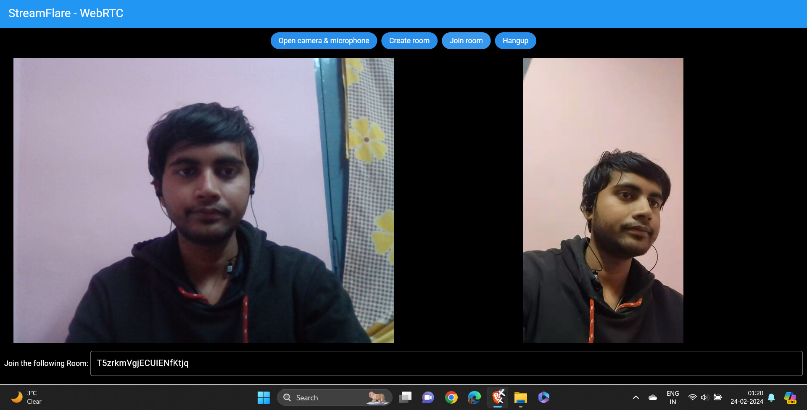

# StreamFlare

StreamFlare is a video calling chat application based on WebRTC technology. It allows users to make real-time video calls between devices, including Android phones and web browsers. This repository contains the Flutter code for both the Flutter web version hosted on [stream-flare.vercel.app](https://stream-flare.vercel.app/) and the Flutter app for Android devices.

## Features

- Real-time video calling using WebRTC
- Support for both Flutter web and Android app
- Clean and intuitive user interface

## Screenshots

### Android App

### Web Version 

## Getting Started

To get started with StreamFlare, follow these steps:

1. Clone this repository:

git clone https://github.com/Hardik-Srivastava/VideoStreamingApp.git

2. Navigate to the project directory:

cd streamflare

3. Install dependencies:

flutter pub get

4. Run the Flutter web version:

flutter run -d web

5. Build the Android app:

flutter build apk

6. Install the APK on your Android device and start making video calls!

## Feedback

If you have any feedback, questions, or suggestions for StreamFlare, feel free to [open an issue](https://github.com/Hardik-Srivastava/VideoStreamingApp). We'd love to hear from you!

## License

This project is licensed under the [MIT License](LICENSE).